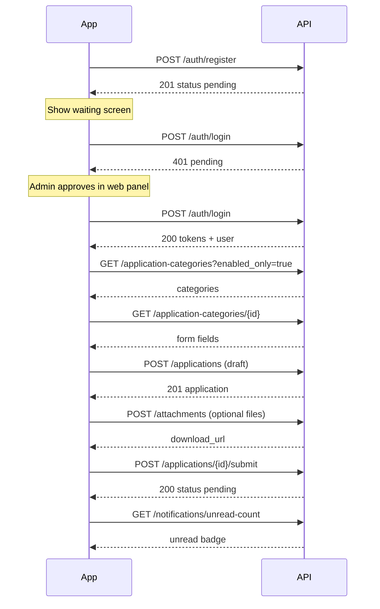

# Smart University Management System — Frontend API Guide (Phase 1)

This document describes **every API exposed in Phase 1** so you can implement **React (web admin)** and **Flutter (mobile)** clients against the current backend. It includes authentication rules, request/response shapes, error handling, pagination, permissions, WebSockets, file uploads, and **end-to-end examples**.

**Live reference:** when the server is running, OpenAPI/Swagger is at `http://<host>:8000/docs`.

---

## Table of contents

1. [Quick start](#1-quick-start)
2. [Conventions](#2-conventions)
3. [Authentication & tokens](#3-authentication--tokens)
4. [Roles & permissions (UI gating)](#4-roles--permissions-ui-gating)
5. [Enums & shared types](#5-enums--shared-types)
6. [API reference by module](#6-api-reference-by-module)
7. [End-to-end flows](#7-end-to-end-flows)
8. [React implementation patterns](#8-react-implementation-patterns)
9. [Flutter implementation patterns](#9-flutter-implementation-patterns)
10. [WebSocket notifications](#10-websocket-notifications)
11. [File attachments (Backblaze B2)](#11-file-attachments-backblaze-b2)
12. [Error handling checklist](#12-error-handling-checklist)
13. [Phase 2 (not implemented yet)](#13-phase-2-not-implemented-yet)

---

## 1. Quick start

| Item | Value |
|------|--------|
| Base URL (local) | `http://localhost:8000` |
| API prefix | `/api/v1` |
| Full API base | `http://localhost:8000/api/v1` |
| Health check | `GET /health` (no auth) |
| Swagger UI | `GET /docs` |
| Content-Type (JSON) | `application/json` |
| Auth header | `Authorization: Bearer <access_token>` |

**Default seeded super admin** (change in production):

- Email: `admin@university.edu`
- Password: `Admin@12345`

**Typical client bootstrap:**

1. Login → store `access_token` + `refresh_token`.
2. Call `GET /api/v1/auth/me` → cache user, role, permissions.
3. Attach `Authorization` on every protected request.
4. On `401`, try `POST /api/v1/auth/refresh` once, then retry or logout.

---

## 2. Conventions

### 2.1 UUIDs and dates

- All IDs are **UUID strings** (e.g. `"3fa85f64-5717-4562-b3fc-2c963f66afa6"`).
- Datetimes are **ISO 8601** with timezone (e.g. `"2026-05-31T12:00:00+00:00"`).

### 2.2 Pagination (list endpoints)

Query parameters (all optional except where noted):

| Param | Type | Default | Description |
|-------|------|---------|-------------|
| `page` | int | `1` | Page number (≥ 1) |
| `size` | int | `20` | Page size (1–100) |
| `sort_by` | string | — | Field name (if supported by endpoint) |
| `sort_order` | `asc` \| `desc` | `desc` | Sort direction |
| `search` | string | — | Free-text search (where supported) |

**Paginated response shape:**

```json
{
  "items": [ /* array of resources */ ],
  "meta": {
    "total": 42,
    "page": 1,
    "size": 20,
    "pages": 3
  }
}
```

### 2.3 Success message responses

Some DELETE/utility endpoints return:

```json
{
  "success": true,
  "message": "Department deleted"
}
```

### 2.4 Application errors

Most business errors use this envelope:

```json
{
  "success": false,
  "error": {
    "code": "authentication_error",
    "message": "Account is pending approval by an administrator"
  }
}
```

| HTTP status | Typical `error.code` | Meaning |
|-------------|----------------------|---------|
| 401 | `authentication_error` | Missing/invalid token, pending account, etc. |
| 403 | `permission_denied` | Logged in but missing permission |
| 404 | `not_found` | Resource not found |
| 409 | `conflict` | Duplicate email, registration number, etc. |
| 422 | `validation_error` | Body/query validation failed |
| 422 | `validation_error` + `details` | FastAPI field errors (see below) |

**FastAPI request validation** (`422`) may include:

```json
{
  "success": false,
  "error": {
    "code": "validation_error",
    "message": "Request validation failed",
    "details": [
      {
        "loc": ["body", "email"],
        "msg": "value is not a valid email address",
        "type": "value_error"
      }
    ]
  }
}
```

---

## 3. Authentication & tokens

### 3.1 Token model

| Token | Lifetime (default) | Use |
|-------|----------------------|-----|
| Access | 30 minutes | `Authorization: Bearer …` on REST |
| Refresh | 7 days | `POST /auth/refresh` only |

Logout is **stateless**: the client deletes stored tokens. The server does not maintain a server-side session list in Phase 1.

### 3.2 Account lifecycle (important for UI)

| `user.status` | Can login? | Typical UI |
|---------------|------------|------------|
| `pending` | No | “Waiting for admin approval” after register |
| `approved` | Yes | Full app |
| `rejected` | No | Show rejection message |
| `suspended` | No | Contact admin |

Only **students** self-register via `POST /auth/register`. Staff accounts are created by admins via `POST /users`.

---

### 3.3 `POST /api/v1/auth/register`

**Auth:** None (public)

**Purpose:** Student self-registration. Creates user with role `student` and status `pending`.

**Request body:**

```json
{
  "email": "ali.khan@student.uni.edu",
  "password": "SecurePass123",
  "full_name": "Ali Khan",
  "phone": "+923001234567",
  "registration_number": "FA22-BSCS-042",
  "program_id": "550e8400-e29b-41d4-a716-446655440000"
}
```

| Field | Required | Notes |
|-------|----------|-------|
| `email` | Yes | Valid email |
| `password` | Yes | Min 8 chars |
| `full_name` | Yes | |
| `registration_number` | Yes | Unique |
| `phone` | No | |
| `program_id` | No | UUID string of a program |

**Success `201`:**

```json
{
  "id": "3fa85f64-5717-4562-b3fc-2c963f66afa6",
  "email": "ali.khan@student.uni.edu",
  "full_name": "Ali Khan",
  "phone": "+923001234567",
  "status": "pending",
  "is_active": true,
  "role_id": "…",
  "department_id": null,
  "role": {
    "id": "…",
    "name": "student",
    "description": "…",
    "is_system": true,
    "permissions": [
      { "id": "…", "code": "create_application", "description": "…" }
    ]
  },
  "student_profile": {
    "id": "…",
    "registration_number": "FA22-BSCS-042",
    "program_id": "550e8400-e29b-41d4-a716-446655440000",
    "semester": null,
    "batch": null
  }
}
```

**Errors:** `409` if email or registration number exists.

**UI:** After success, route to “pending approval” screen; do not attempt login until admin approves.

---

### 3.4 `POST /api/v1/auth/login`

**Auth:** None

**Request:**

```json
{
  "email": "admin@university.edu",
  "password": "Admin@12345"
}
```

**Success `200`:**

```json
{
  "user": { /* UserRead — same shape as register response */ },
  "tokens": {
    "access_token": "eyJhbGciOiJIUzI1NiIsInR5cCI6IkpXVCJ9…",
    "refresh_token": "eyJhbGciOiJIUzI1NiIsInR5cCI6IkpXVCJ9…",
    "token_type": "bearer"
  }
}
```

**Errors `401`:** Invalid credentials, `pending`, `rejected`, `suspended`, or inactive account.

---

### 3.5 `POST /api/v1/auth/refresh`

**Auth:** None (send refresh token in body)

**Request:**

```json
{
  "refresh_token": "eyJhbGciOiJIUzI1NiIsInR5cCI6IkpXVCJ9…"
}
```

**Success `200`:**

```json
{
  "access_token": "…",
  "refresh_token": "…",
  "token_type": "bearer"
}
```

---

### 3.6 `POST /api/v1/auth/logout`

**Auth:** Bearer access token

**Success `200`:**

```json
{
  "success": true,
  "message": "Logged out successfully"
}
```

**Client:** Clear secure storage for both tokens and user cache.

---

### 3.7 `GET /api/v1/auth/me`

**Auth:** Bearer

**Success `200`:** `UserRead` (current user with `role.permissions`).

Use on app start to restore session and drive permission-based navigation.

---

## 4. Roles & permissions (UI gating)

Permissions are returned on `user.role.permissions[]` as `{ code, description }`.

**Do not hardcode role names only** — prefer checking `permission.code` so admin changes in DB still work. Super admin bypasses all checks on the server; you may treat `role.name === "super_admin"` as “show everything” in UI.

### 4.1 Permission codes (Phase 1)

| Code | Typical UI |
|------|------------|
| `create_application` | Student: new application |
| `view_own_applications` | Student: my applications list |
| `view_department_applications` | HOD/staff: dept queue |
| `view_all_applications` | Registrar: all apps + audit logs |
| `approve_application` | Approve / reject / forward / return |
| `manage_application_categories` | Admin: categories & form builder |
| `manage_workflows` | Admin: workflow designer |
| `manage_departments` | Admin: departments & programs |
| `manage_users` | Admin: users & approvals |
| `manage_roles` | Admin: view roles/permissions |
| `manage_settings` | Admin: system settings |
| `manage_attendance` | Phase 2 |
| `view_attendance` | Phase 2 |
| `view_analytics` | Phase 2 dashboards |
| `use_ai_assistant` | Phase 2 AI writer |

### 4.2 Role names (for display)

`student`, `hod`, `hod_assistant`, `examination_officer`, `registrar_officer`, `it_officer`, `transport_officer`, `treasurer_officer`, `super_admin`

---

## 5. Enums & shared types

Use these exact string values in JSON.

### User status

`pending` | `approved` | `rejected` | `suspended`

### Application status

`draft` | `submitted` | `pending` | `under_review` | `returned` | `rejected` | `approved` | `forwarded` | `completed` | `closed`

### Field types (dynamic forms)

`text` | `textarea` | `number` | `date` | `dropdown` | `radio` | `checkbox` | `file` | `email` | `phone`

### Workflow actions (officer actions on an application)

`submit` | `approve` | `reject` | `forward` | `return_for_correction` | `add_remarks` | `close` | `reopen`

> Note: `submit` is triggered via `POST …/submit`, not the actions endpoint.

### Notification types

`application_submitted` | `application_approved` | `application_rejected` | `application_returned` | `application_forwarded` | `new_remark` | `attendance_marked` | `account_approved` | `system`

---

## 6. API reference by module

Below, **Auth** column:

- **Public** — no header
- **User** — any approved logged-in user
- **Permission: `code`** — requires that permission (super admin always passes)

---

### 6.1 Users — `/api/v1/users`

| Method | Path | Auth | Description |
|--------|------|------|-------------|
| GET | `/users` | `manage_users` | List users (paginated) |
| POST | `/users` | `manage_users` | Create staff user |
| PATCH | `/users/me` | User | Update own profile |
| GET | `/users/{user_id}` | `manage_users` | Get user |
| PATCH | `/users/{user_id}` | `manage_users` | Update user |
| PATCH | `/users/{user_id}/status` | `manage_users` | Approve / reject / suspend |

#### List users

`GET /users?page=1&size=20&status=pending&role_id=<uuid>&department_id=<uuid>&search=ali`

**Success `200`:** `Page<UserRead>`

#### Create user (admin)

**Request:**

```json
{
  "email": "hod.cs@uni.edu",
  "password": "TempPass123!",
  "full_name": "Dr. Sara Ahmed",
  "phone": null,
  "role_name": "hod",
  "department_id": "dept-uuid-here",
  "status": "approved"
}
```

`role_name` must match a seeded role name (e.g. `hod`, `examination_officer`).

#### Approve student (practical example)

`PATCH /users/{user_id}/status`

```json
{
  "status": "approved"
}
```

**Success `200`:** Updated `UserRead`. Backend also sends `account_approved` notification to that user.

#### Update own profile

`PATCH /users/me` — cannot change `department_id` via self-service.

```json
{
  "full_name": "Ali Khan Updated",
  "phone": "+923009999999"
}
```

---

### 6.2 Roles — `/api/v1/roles`

| Method | Path | Auth | Description |
|--------|------|------|-------------|
| GET | `/roles` | `manage_roles` | List roles with permissions |
| GET | `/roles/permissions` | `manage_roles` | List all permissions |

Use when building an admin “roles & permissions” screen.

---

### 6.3 Departments & programs — `/api/v1/departments`

| Method | Path | Auth | Description |
|--------|------|------|-------------|
| GET | `/departments` | User | List departments (paginated) |
| POST | `/departments` | `manage_departments` | Create department |
| GET | `/departments/{id}` | User | Get one (with programs) |
| PATCH | `/departments/{id}` | `manage_departments` | Update |
| DELETE | `/departments/{id}` | `manage_departments` | Delete |
| GET | `/departments/{id}/programs` | User | List programs |
| POST | `/departments/{id}/programs` | `manage_departments` | Add program |
| PATCH | `/departments/programs/{program_id}` | `manage_departments` | Update program |
| DELETE | `/departments/programs/{program_id}` | `manage_departments` | Delete program |

#### List departments (student pick program on register)

`GET /departments?page=1&size=50`

**Example item:**

```json
{
  "id": "…",
  "name": "CS & IT Department",
  "code": "CSIT",
  "description": "Computing programs",
  "is_active": true,
  "hod_id": null,
  "programs": [
    {
      "id": "550e8400-e29b-41d4-a716-446655440000",
      "name": "BS Computer Science",
      "code": "BSCS",
      "description": null,
      "duration_years": 4,
      "is_active": true,
      "department_id": "…"
    }
  ]
}
```

**Registration UI:** Load departments → show programs → pass selected `program_id` to register.

#### Create department

```json
{
  "name": "CS & IT Department",
  "code": "CSIT",
  "description": "Computing",
  "hod_id": null
}
```

Codes are stored **uppercase** (e.g. `CSIT`).

---

### 6.4 Application categories & forms — `/api/v1/application-categories`

| Method | Path | Auth | Description |
|--------|------|------|-------------|
| GET | `/application-categories` | User | List categories |
| POST | `/application-categories` | `manage_application_categories` | Create |
| GET | `/application-categories/{id}` | User | Detail + forms + fields |
| PATCH | `/application-categories/{id}` | `manage_application_categories` | Update |
| DELETE | `/application-categories/{id}` | `manage_application_categories` | Delete |
| POST | `/application-categories/{id}/forms` | `manage_application_categories` | Create form + fields |
| GET | `/application-categories/forms/{form_id}` | User | Get form |
| POST | `/application-categories/forms/{form_id}/fields` | `manage_application_categories` | Add field |
| DELETE | `/application-categories/fields/{field_id}` | `manage_application_categories` | Delete field |

#### List categories (student app home)

`GET /application-categories?enabled_only=true&page=1&size=20`

**Category (list item):**

```json
{
  "id": "…",
  "name": "Transcript Request",
  "description": "Request an official academic transcript",
  "is_enabled": true,
  "department_id": "…",
  "workflow_id": "…"
}
```

#### Get category detail (build dynamic form UI)

`GET /application-categories/{category_id}`

Returns `CategoryDetail` with `forms[].fields[]`. Use the **active** form (highest `version` where `is_active` is true — typically one active form per category).

**Field example:**

```json
{
  "id": "…",
  "form_id": "…",
  "key": "reason",
  "label": "Reason for request",
  "field_type": "textarea",
  "is_required": true,
  "default_value": null,
  "validation": null,
  "options": null,
  "display_order": 1,
  "visibility_rule": null
}
```

**Rendering rules:**

| `field_type` | Widget | Value sent in `responses` |
|--------------|--------|-------------------------|
| `text`, `textarea` | Text input | string |
| `number` | Number | number or string |
| `date` | Date picker | `"YYYY-MM-DD"` |
| `email`, `phone` | Validated input | string |
| `dropdown`, `radio` | Options from `options[]` | one of `options` |
| `checkbox` | Multi-select | array of strings (server joins to comma-separated) |
| `file` | File picker + upload API | upload file first; store URL/key in value or link via attachments |

**Validation object examples** (from admin):

- Number: `{ "min": 1, "max": 10 }`
- Text: `{ "min_length": 10, "max_length": 500, "pattern": "^[A-Za-z]+$" }`

#### Create form (admin)

`POST /application-categories/{category_id}/forms`

```json
{
  "name": "Transcript Request Form",
  "fields": [
    {
      "key": "reason",
      "label": "Reason for request",
      "field_type": "textarea",
      "is_required": true,
      "display_order": 1
    },
    {
      "key": "copies",
      "label": "Number of copies",
      "field_type": "number",
      "is_required": true,
      "validation": { "min": 1, "max": 5 },
      "display_order": 2
    },
    {
      "key": "delivery",
      "label": "Delivery method",
      "field_type": "dropdown",
      "is_required": true,
      "options": ["Pickup", "Email", "Postal"],
      "display_order": 3
    }
  ]
}
```

---

### 6.5 Applications — `/api/v1/applications`

| Method | Path | Auth | Description |
|--------|------|------|-------------|
| GET | `/applications` | User (scoped) | List applications (supports `search` query parameter) |
| POST | `/applications` | User (student) | Create **draft** |
| GET | `/applications/{id}` | User (scoped) | Get one |
| POST | `/applications/{id}/submit` | Owner / admin | Submit → starts workflow |
| POST | `/applications/{id}/actions` | `approve_application` | Officer workflow action |
| GET | `/applications/{id}/timeline` | User (scoped) | Workflow instance + history (with eager actor/step details) |
| POST | `/applications/check-slas` | `manage_settings` | Run SLA check and trigger assignee notifications |
| GET | `/applications/{id}/export` | User (scoped) | Export approved/completed application as PDF |

#### List scoping (server-side — do not filter only on client)

| Who | Sees |
|-----|------|
| Student | Own applications only |
| Staff with `view_department_applications` | Same `department_id` as user |
| Staff with `view_all_applications` or super admin | All |

`GET /applications?status=pending&category_id=<uuid>&page=1&size=20&search=Ali`
- The `search` parameter filters applications by matching the search term against application subject (case-insensitive).


#### Create draft application

`POST /applications`

```json
{
  "category_id": "category-uuid",
  "subject": "Transcript for semester 4",
  "responses": [
    { "field_key": "reason", "value": "Need transcript for internship" },
    { "field_key": "copies", "value": 2 },
    { "field_key": "delivery", "value": "Pickup" }
  ]
}
```

**Success `201`:**

```json
{
  "id": "app-uuid",
  "category_id": "…",
  "form_id": "…",
  "student_id": "…",
  "department_id": "…",
  "status": "draft",
  "subject": "Transcript for semester 4",
  "submitted_at": null,
  "created_at": "2026-05-31T12:00:00+00:00",
  "responses": [
    {
      "id": "…",
      "field_id": "…",
      "field_key": "reason",
      "value": "Need transcript for internship"
    }
  ]
}
```

Validation runs against the active form; unknown keys or invalid values → `422 validation_error`.

#### Submit application

`POST /applications/{id}/submit`  
**Body:** none  
**Auth:** Owner (student) or super admin

**Behavior:**

- If category has `workflow_id`: status → `pending`, workflow instance created at step 1.
- If no workflow: status → `submitted`.
- Notifications sent to student and current step assignees.

**Success `200`:** Updated `ApplicationRead` with new `status` and `submitted_at`.

#### Officer action

`POST /applications/{id}/actions`

```json
{
  "action": "approve",
  "remarks": "Approved by HOD"
}
```

| `action` | When to show | Notes |
|----------|--------------|-------|
| `approve` | Current step actor | Advances workflow; may set `forwarded` or `completed` |
| `reject` | If step allows | Sets `rejected`, completes workflow |
| `return_for_correction` | If step allows | Sets `returned`; student may fix and submit again |
| `forward` | Same as approve in engine | Advances step |
| `add_remarks` | Officers | **Requires** `remarks`; status unchanged |
| `close` | Officers | Sets `closed` |
| `reopen` | Officers | Reopens completed workflow |

**Success `200`:** Updated application.

**Errors `403`:** User is not the role/department for the current workflow step.

#### Timeline (audit / history UI)

`GET /applications/{id}/timeline`

**Success `200`:**

```json
{
  "id": "instance-uuid",
  "workflow_id": "…",
  "application_id": "…",
  "current_step_id": "step-uuid-or-null",
  "is_complete": false,
  "started_at": "2026-05-31T12:05:00+00:00",
  "completed_at": null,
  "actions": [
    {
      "id": "…",
      "instance_id": "…",
      "step_id": "…",
      "actor_id": "…",
      "action": "approve",
      "remarks": "Approved by HOD",
      "from_status": "pending",
      "to_status": "forwarded",
      "created_at": "2026-05-31T12:10:00+00:00"
    }
  ]
}
```

Pair with `GET /audit-logs?entity_type=application&entity_id=<app_id>` for a full audit trail (admin).

---

### 6.6 Workflows — `/api/v1/workflows`

| Method | Path | Auth | Description |
|--------|------|------|-------------|
| GET | `/workflows` | `manage_workflows` | List definitions |
| POST | `/workflows` | `manage_workflows` | Create with steps |
| GET | `/workflows/{id}` | `manage_workflows` | Get one |
| PATCH | `/workflows/{id}` | `manage_workflows` | Update metadata |
| DELETE | `/workflows/{id}` | `manage_workflows` | Delete |
| POST | `/workflows/{id}/steps` | `manage_workflows` | Add step |
| POST | `/workflows/{id}/reorder` | `manage_workflows` | Reorder steps |
| DELETE | `/workflows/steps/{step_id}` | `manage_workflows` | Delete step |

#### Create workflow (admin)

```json
{
  "name": "Transcript Request Workflow",
  "description": "Student -> HOD -> Examination",
  "steps": [
    {
      "step_order": 1,
      "name": "HOD Approval",
      "role_id": "hod-role-uuid",
      "department_id": "dept-uuid",
      "approval_required": true,
      "can_reject": true,
      "can_return": true,
      "is_final": false
    },
    {
      "step_order": 2,
      "name": "Examination",
      "role_id": "exam-officer-role-uuid",
      "approval_required": true,
      "is_final": true
    }
  ]
}
```

Then assign `workflow_id` on the application category.

#### Reorder steps

`POST /workflows/{id}/reorder`

```json
{
  "ordered_step_ids": ["step-uuid-1", "step-uuid-2"]
}
```

Must include **exactly** all step IDs for that workflow.

---

### 6.7 Notifications — `/api/v1/notifications`

| Method | Path | Auth | Description |
|--------|------|------|-------------|
| GET | `/notifications` | User | Paginated list |
| GET | `/notifications/unread-count` | User | Badge count |
| POST | `/notifications/{id}/read` | User | Mark one read |
| POST | `/notifications/read-all` | User | Mark all read |
| WebSocket | `/notifications/ws?token=` | Access token in query | Realtime push |

#### List

`GET /notifications?unread_only=true&page=1&size=20`

**Item:**

```json
{
  "id": "…",
  "type": "application_forwarded",
  "title": "Application awaiting your action",
  "body": "An application 'Transcript for semester 4' needs your review.",
  "reference_type": "application",
  "reference_id": "app-uuid",
  "is_read": false,
  "read_at": null,
  "created_at": "2026-05-31T12:10:00+00:00"
}
```

**Navigation:** If `reference_type === "application"`, open application detail with `reference_id`.

#### Unread count

`GET /notifications/unread-count`

```json
{
  "unread": 3
}
```

---

### 6.8 Attachments — `/api/v1/attachments`

| Method | Path | Auth | Description |
|--------|------|------|-------------|
| POST | `/attachments` | User | Upload (multipart) |
| GET | `/attachments/{id}` | User | Metadata + download URL |
| DELETE | `/attachments/{id}` | User | Delete |
| GET | `/attachments/local/{key}` | User | Local dev only |

**Allowed extensions:** `pdf`, `docx`, `png`, `jpg`, `jpeg`  
**Max size:** 10 MB (default, configurable server-side)

#### Upload

`POST /attachments?owner_type=application&owner_id=<uuid>`  
**Content-Type:** `multipart/form-data`  
**Field name:** `file`

**Success `201`:**

```json
{
  "id": "…",
  "owner_type": "application",
  "owner_id": "app-uuid",
  "filename": "transcript.pdf",
  "content_type": "application/pdf",
  "size_bytes": 102400,
  "created_at": "…",
  "download_url": "https://…presigned-b2-url…"
}
```

Use `download_url` in the browser/`url_launcher` — it expires (default 1 hour). Refresh by calling `GET /attachments/{id}` again.

**Typical flow for `file` form fields:**

1. Create draft application (get `application.id`).
2. Upload files with `owner_type=application`, `owner_id=application.id`.
3. Put attachment id or filename in the `file` field response if needed.

---

### 6.9 Audit logs — `/api/v1/audit-logs`

| Method | Path | Auth | Description |
|--------|------|------|-------------|
| GET | `/audit-logs` | `view_all_applications` | Paginated audit trail (supports `search` query parameter) |

`GET /audit-logs?entity_type=application&entity_id=<uuid>&actor_id=<uuid>&page=1&size=50&search=revert`
- The `search` parameter filters audit logs by action, entity_type, or remarks.


**Item:**

```json
{
  "id": "…",
  "actor_id": "…",
  "actor_role": "hod",
  "action": "approve",
  "entity_type": "application",
  "entity_id": "…",
  "old_status": "pending",
  "new_status": "forwarded",
  "remarks": "Approved by HOD",
  "department_id": "…",
  "ip_address": "203.0.113.10",
  "created_at": "…"
}
```

---

### 6.10 System settings — `/api/v1/system-settings`

| Method | Path | Auth | Description |
|--------|------|------|-------------|
| GET | `/system-settings` | `manage_settings` | List all |
| PUT | `/system-settings` | `manage_settings` | Upsert one |

```json
{
  "key": "max_upload_size_mb",
  "value": "10",
  "description": "Max attachment size in MB"
}
```

---

### 6.11 Analytics — `/api/v1/analytics`

| Method | Path | Auth | Description |
|--------|------|------|-------------|
| GET | `/analytics/overview` | `view_analytics` | High-level metrics counts |
| GET | `/analytics/by-department` | `view_analytics` | Department category counts |
| GET | `/analytics/turnaround` | `view_analytics` | Mean approval turnaround time per step |
| GET | `/analytics/approval-rate` | `view_analytics` | Percentage rate of approved applications |
| GET | `/analytics/bottlenecks` | `view_analytics` | Stuck or slow approval steps |

All analytics endpoints support date filters: `GET /analytics/...?start_date=2026-01-01T00:00:00Z&end_date=2026-07-31T23:59:59Z`.

---

### 6.12 Dashboard — `/api/v1/dashboard`

| Method | Path | Auth | Description |
|--------|------|------|-------------|
| GET | `/dashboard/summary` | User | Scoped summary metrics tailored to user role |

Returns role-specific summaries (Student profile/pending/drafts, Officer queue metrics, or Admin general statistics).

---

### 6.13 AI Assistant — `/api/v1/applications/ai-draft`

| Method | Path | Auth | Description |
|--------|------|------|-------------|
| POST | `/applications/ai-draft` | `use_ai_assistant` | Pre-fill dynamic application responses |

**Request Body:**
```json
{
  "prompt": "I want to freeze my semester because I got a job offer",
  "category_id": "category-uuid",
  "form_id": "form-uuid"
}
```

**Success Response `201`:** returns a prefilled Draft `ApplicationRead` matching form definitions.

---

## 7. End-to-end flows

### 7.1 Student mobile app (Flutter) — happy path



### 7.2 Admin web (React) — approve student + process application

1. `POST /auth/login` as super admin.
2. `GET /users?status=pending` → table of registrations.
3. `PATCH /users/{id}/status` with `{ "status": "approved" }`.
4. `GET /applications?status=pending` (or department-scoped for HOD).
5. Open app → `GET /applications/{id}/timeline`.
6. `POST /applications/{id}/actions` with `{ "action": "approve", "remarks": "…" }`.
7. Student receives notification; status becomes `forwarded` or `completed`.

### 7.3 Returned application (student correction)

1. Officer: `POST …/actions` with `return_for_correction` + remarks.
2. Student sees `status: "returned"` and notification.
3. Student edits responses (Phase 1: create new draft not supported — **update endpoint is not in Phase 1**; workaround: communicate via remarks and resubmit flow if you add PATCH later, or student submits again after return).
4. **Current backend:** student can `POST …/submit` again when status is `returned` (re-submission allowed).

---

## 8. React implementation patterns

### 8.1 Recommended stack

- **HTTP:** `axios` or `fetch`
- **State:** React Query (TanStack Query) for lists + cache
- **Auth storage:** `httpOnly` cookies (if you add a BFF) or `localStorage` / `sessionStorage` for tokens (mobile-like SPA)
- **Types:** generate from OpenAPI (`openapi-typescript`) from `/api/v1/openapi.json`

### 8.2 API client example (axios)

```typescript
// src/api/client.ts
import axios from "axios";

const API_BASE = import.meta.env.VITE_API_URL ?? "http://localhost:8000/api/v1";

export const api = axios.create({
  baseURL: API_BASE,
  headers: { "Content-Type": "application/json" },
});

api.interceptors.request.use((config) => {
  const token = localStorage.getItem("access_token");
  if (token) config.headers.Authorization = `Bearer ${token}`;
  return config;
});

let refreshing: Promise<string> | null = null;

api.interceptors.response.use(
  (r) => r,
  async (error) => {
    const original = error.config;
    if (error.response?.status === 401 && !original._retry) {
      original._retry = true;
      const refresh = localStorage.getItem("refresh_token");
      if (!refresh) throw error;
      if (!refreshing) {
        refreshing = api
          .post("/auth/refresh", { refresh_token: refresh })
          .then((res) => {
            localStorage.setItem("access_token", res.data.access_token);
            localStorage.setItem("refresh_token", res.data.refresh_token);
            return res.data.access_token;
          })
          .finally(() => (refreshing = null));
      }
      const newToken = await refreshing;
      original.headers.Authorization = `Bearer ${newToken}`;
      return api(original);
    }
    throw error;
  }
);
```

### 8.3 Login hook example

```typescript
// src/features/auth/useLogin.ts
import { useMutation } from "@tanstack/react-query";
import { api } from "../../api/client";

export function useLogin() {
  return useMutation({
    mutationFn: async (body: { email: string; password: string }) => {
      const { data } = await api.post("/auth/login", body);
      localStorage.setItem("access_token", data.tokens.access_token);
      localStorage.setItem("refresh_token", data.tokens.refresh_token);
      return data.user;
    },
  });
}
```

### 8.4 Permission guard component

```tsx
function Can({ permission, children }: { permission: string; children: React.ReactNode }) {
  const user = useCurrentUser(); // from context populated by GET /auth/me
  if (!user) return null;
  if (user.role?.name === "super_admin") return <>{children}</>;
  const codes = user.role?.permissions?.map((p) => p.code) ?? [];
  if (!codes.includes(permission)) return null;
  return <>{children}</>;
}

// Usage:
<Can permission="manage_users">
  <Link to="/admin/users">Users</Link>
</Can>
```

### 8.5 Dynamic form renderer (sketch)

```tsx
function DynamicField({ field, value, onChange }: { field: FieldRead; value: unknown; onChange: (v: unknown) => void }) {
  switch (field.field_type) {
    case "textarea":
      return <textarea required={field.is_required} value={String(value ?? "")} onChange={(e) => onChange(e.target.value)} />;
    case "dropdown":
      return (
        <select required={field.is_required} value={String(value ?? "")} onChange={(e) => onChange(e.target.value)}>
          <option value="">Select…</option>
          {field.options?.map((o) => (
            <option key={String(o)} value={String(o)}>{String(o)}</option>
          ))}
        </select>
      );
    case "number":
      return <input type="number" required={field.is_required} value={Number(value ?? "")} onChange={(e) => onChange(e.target.value)} />;
    case "date":
      return <input type="date" required={field.is_required} value={String(value ?? "")} onChange={(e) => onChange(e.target.value)} />;
    default:
      return <input type="text" required={field.is_required} value={String(value ?? "")} onChange={(e) => onChange(e.target.value)} />;
  }
}
```

### 8.6 File upload (React)

```typescript
async function uploadAttachment(file: File, ownerType: string, ownerId: string) {
  const form = new FormData();
  form.append("file", file);
  const { data } = await api.post("/attachments", form, {
    params: { owner_type: ownerType, owner_id: ownerId },
    headers: { "Content-Type": "multipart/form-data" },
  });
  return data; // includes download_url
}
```

---

## 9. Flutter implementation patterns

### 9.1 Recommended packages

```yaml
dependencies:
  dio: ^5.7.0
  flutter_secure_storage: ^9.2.2
  web_socket_channel: ^3.0.1
```

### 9.2 API client (Dio)

```dart
import 'package:dio/dio.dart';
import 'package:flutter_secure_storage/flutter_secure_storage.dart';

class ApiClient {
  ApiClient() : _dio = Dio(BaseOptions(
    baseUrl: 'http://10.0.2.2:8000/api/v1', // Android emulator → host machine
    connectTimeout: const Duration(seconds: 30),
  )) {
    _dio.interceptors.add(InterceptorsWrapper(
      onRequest: (options, handler) async {
        final token = await _storage.read(key: 'access_token');
        if (token != null) {
          options.headers['Authorization'] = 'Bearer $token';
        }
        handler.next(options);
      },
      onError: (e, handler) async {
        if (e.response?.statusCode == 401) {
          final refreshed = await _tryRefresh();
          if (refreshed) {
            final opts = e.requestOptions;
            opts.headers['Authorization'] = 'Bearer ${await _storage.read(key: 'access_token')}';
            handler.resolve(await _dio.fetch(opts));
            return;
          }
        }
        handler.next(e);
      },
    ));
  }

  final Dio _dio;
  final _storage = const FlutterSecureStorage();

  Future<bool> _tryRefresh() async {
    final refresh = await _storage.read(key: 'refresh_token');
    if (refresh == null) return false;
    try {
      final res = await _dio.post('/auth/refresh', data: {'refresh_token': refresh});
      await _storage.write(key: 'access_token', value: res.data['access_token']);
      await _storage.write(key: 'refresh_token', value: res.data['refresh_token']);
      return true;
    } catch (_) {
      return false;
    }
  }

  Future<Response> login(String email, String password) async {
    return _dio.post('/auth/login', data: {'email': email, 'password': password});
  }
}
```

> **iOS simulator:** use `http://localhost:8000`. **Physical device:** use your PC’s LAN IP, e.g. `http://192.168.1.10:8000`.

### 9.3 Student registration example

```dart
Future<void> registerStudent() async {
  final response = await dio.post('/auth/register', data: {
    'email': 'ali.khan@student.uni.edu',
    'password': 'SecurePass123',
    'full_name': 'Ali Khan',
    'registration_number': 'FA22-BSCS-042',
    'program_id': selectedProgramId,
  });
  if (response.statusCode == 201) {
    // Navigate to PendingApprovalScreen
  }
}
```

### 9.4 Submit application example

```dart
Future<void> submitApplication(String applicationId) async {
  final res = await dio.post('/applications/$applicationId/submit');
  final status = res.data['status'];
  // pending | submitted
}
```

### 9.5 Upload file (Flutter)

```dart
import 'package:dio/dio.dart';

Future<Map<String, dynamic>> uploadFile(
  Dio dio,
  String path,
  String ownerType,
  String ownerId,
) async {
  final form = FormData.fromMap({
    'file': await MultipartFile.fromFile(path, filename: path.split('/').last),
  });
  final res = await dio.post(
    '/attachments',
    data: form,
    queryParameters: {'owner_type': ownerType, 'owner_id': ownerId},
  );
  return res.data as Map<String, dynamic>;
}
```

### 9.6 Parse API errors (Flutter)

```dart
String errorMessage(DioException e) {
  final data = e.response?.data;
  if (data is Map && data['error'] is Map) {
    return data['error']['message']?.toString() ?? 'Request failed';
  }
  return e.message ?? 'Network error';
}
```

---

## 10. WebSocket notifications

**URL pattern:**

```
ws://<host>:8000/api/v1/notifications/ws?token=<access_token>
```

For production use `wss://` behind TLS.

**React example:**

```typescript
const token = localStorage.getItem("access_token");
const ws = new WebSocket(`ws://localhost:8000/api/v1/notifications/ws?token=${token}`);

ws.onmessage = (event) => {
  const msg = JSON.parse(event.data);
  if (msg.event === "notification") {
    // msg.data: { id, type, title, body, reference_type, reference_id }
    queryClient.invalidateQueries({ queryKey: ["notifications"] });
    queryClient.invalidateQueries({ queryKey: ["unread-count"] });
  }
};
```

**Flutter:** use `web_socket_channel` with the same URL. Reconnect when access token is refreshed.

**Fallback:** poll `GET /notifications/unread-count` every 30–60s if WebSocket is unavailable.

---

## 11. File attachments (Backblaze B2)

- Production uses **presigned URLs** — open `download_url` directly (browser / `launchUrl` / `CachedNetworkImage` won’t work for private buckets without presign).
- URLs **expire** (default 1 hour). Refresh via `GET /attachments/{id}` before download.
- Do not send file bytes as Base64 in JSON unless necessary; use multipart upload endpoint.

---

## 12. Error handling checklist

| Scenario | Status | Client action |
|----------|--------|---------------|
| Wrong password | 401 | Show message |
| Pending account | 401 | Route to approval waiting screen |
| Token expired | 401 | Refresh once, else logout |
| Missing permission | 403 | Hide action / show “not allowed” |
| Validation on form | 422 | Map `details` to fields |
| Duplicate email on register | 409 | Show “already registered” |
| Officer wrong step | 403 | “Not your turn to review” |

Always read `error.message` for user-facing text.

---

## 13. Phase 2 (not implemented yet)

These modules are **scaffolded only** — no REST routes yet:

| Module | Planned |
|--------|---------|
| `attendance/` | GPS/BLE/hybrid attendance |

Do not call endpoints for these until Phase 2 is released. Watch repo changelog / OpenAPI tags.


---

## Appendix A — Endpoint index

| # | Method | Path |
|---|--------|------|
| | **Auth** | |
| 1 | POST | `/api/v1/auth/register` |
| 2 | POST | `/api/v1/auth/login` |
| 3 | POST | `/api/v1/auth/refresh` |
| 4 | POST | `/api/v1/auth/logout` |
| 5 | GET | `/api/v1/auth/me` |
| | **Users** | |
| 6 | GET | `/api/v1/users` |
| 7 | POST | `/api/v1/users` |
| 8 | PATCH | `/api/v1/users/me` |
| 9 | GET | `/api/v1/users/{user_id}` |
| 10 | PATCH | `/api/v1/users/{user_id}` |
| 11 | PATCH | `/api/v1/users/{user_id}/status` |
| | **Roles** | |
| 12 | GET | `/api/v1/roles` |
| 13 | GET | `/api/v1/roles/permissions` |
| | **Departments** | |
| 14 | GET | `/api/v1/departments` |
| 15 | POST | `/api/v1/departments` |
| 16 | GET | `/api/v1/departments/{department_id}` |
| 17 | PATCH | `/api/v1/departments/{department_id}` |
| 18 | DELETE | `/api/v1/departments/{department_id}` |
| 19 | GET | `/api/v1/departments/{department_id}/programs` |
| 20 | POST | `/api/v1/departments/{department_id}/programs` |
| 21 | PATCH | `/api/v1/departments/programs/{program_id}` |
| 22 | DELETE | `/api/v1/departments/programs/{program_id}` |
| | **Application categories & forms** | |
| 23 | GET | `/api/v1/application-categories` |
| 24 | POST | `/api/v1/application-categories` |
| 25 | GET | `/api/v1/application-categories/{category_id}` |
| 26 | PATCH | `/api/v1/application-categories/{category_id}` |
| 27 | DELETE | `/api/v1/application-categories/{category_id}` |
| 28 | POST | `/api/v1/application-categories/{category_id}/forms` |
| 29 | GET | `/api/v1/application-categories/forms/{form_id}` |
| 30 | POST | `/api/v1/application-categories/forms/{form_id}/fields` |
| 31 | DELETE | `/api/v1/application-categories/fields/{field_id}` |
| | **Applications** | |
| 32 | GET | `/api/v1/applications` |
| 33 | POST | `/api/v1/applications` |
| 34 | GET | `/api/v1/applications/{application_id}` |
| 35 | POST | `/api/v1/applications/{application_id}/submit` |
| 36 | POST | `/api/v1/applications/{application_id}/actions` |
| 37 | GET | `/api/v1/applications/{application_id}/timeline` |
| | **Workflows** | |
| 38 | GET | `/api/v1/workflows` |
| 39 | POST | `/api/v1/workflows` |
| 40 | GET | `/api/v1/workflows/{workflow_id}` |
| 41 | PATCH | `/api/v1/workflows/{workflow_id}` |
| 42 | DELETE | `/api/v1/workflows/{workflow_id}` |
| 43 | POST | `/api/v1/workflows/{workflow_id}/steps` |
| 44 | POST | `/api/v1/workflows/{workflow_id}/reorder` |
| 45 | DELETE | `/api/v1/workflows/steps/{step_id}` |
| | **Notifications** | |
| 46 | GET | `/api/v1/notifications` |
| 47 | GET | `/api/v1/notifications/unread-count` |
| 48 | POST | `/api/v1/notifications/{notification_id}/read` |
| 49 | POST | `/api/v1/notifications/read-all` |
| 50 | WS | `/api/v1/notifications/ws` |
| | **Attachments** | |
| 51 | POST | `/api/v1/attachments` |
| 52 | GET | `/api/v1/attachments/{attachment_id}` |
| 53 | DELETE | `/api/v1/attachments/{attachment_id}` |
| | **Audit logs** | |
| 54 | GET | `/api/v1/audit-logs` |
| | **System settings** | |
| 55 | GET | `/api/v1/system-settings` |
| 56 | PUT | `/api/v1/system-settings` |
| | **Analytics** | |
| 57 | GET | `/api/v1/analytics/overview` |
| 58 | GET | `/api/v1/analytics/by-department` |
| 59 | GET | `/api/v1/analytics/turnaround` |
| 60 | GET | `/api/v1/analytics/approval-rate` |
| 61 | GET | `/api/v1/analytics/bottlenecks` |
| | **Dashboard** | |
| 62 | GET | `/api/v1/dashboard/summary` |
| | **AI Assistant & SLA / PDF** | |
| 63 | POST | `/api/v1/applications/ai-draft` |
| 64 | POST | `/api/v1/applications/check-slas` |
| 65 | GET | `/api/v1/applications/{application_id}/export` |
| | **Health** | |
| 66 | GET | `/health` |

---

## Appendix B — Suggested screen map

### Flutter (student mobile)

| Screen | APIs |
|--------|------|
| Register | `GET /departments`, `POST /auth/register` |
| Login | `POST /auth/login` |
| Home | `GET /application-categories?enabled_only=true`, `GET /dashboard/summary` |
| New application | `GET /application-categories/{id}`, `POST /applications`, `POST /attachments`, `POST /applications/{id}/submit`, `POST /applications/ai-draft` (AI Assistant pre-fill) |
| My applications | `GET /applications` |
| Application detail | `GET /applications/{id}`, `GET /applications/{id}/timeline` |
| Notifications | `GET /notifications`, WebSocket, `POST …/read` |
| Profile | `GET /auth/me`, `PATCH /users/me` |

### React (admin web)

| Screen | APIs |
|--------|------|
| Login | `POST /auth/login` |
| Dashboard shell | `GET /auth/me`, `GET /dashboard/summary` |
| Pending registrations | `GET /users?status=pending`, `PATCH /users/{id}/status` |
| Users | `GET/POST/PATCH /users` |
| Departments & programs | `/departments` CRUD |
| Categories & form builder | `/application-categories` + forms/fields |
| Workflows | `/workflows` CRUD |
| Application queue | `GET /applications` (supports `search` query parameter) |
| Review application | `GET /applications/{id}`, `timeline`, `POST …/actions`, `GET /applications/{id}/export` (PDF Export) |
| Analytics Dashboard | `GET /analytics/overview`, `GET /analytics/by-department`, `GET /analytics/turnaround`, `GET /analytics/approval-rate`, `GET /analytics/bottlenecks` |
| Audit | `GET /audit-logs` (supports `search` query parameter) |
| Settings | `/system-settings`, `POST /applications/check-slas` |

---

*Document version: Phase 1.1 (backend completion with Analytics, Dashboards, and AI Assistant integration).*

